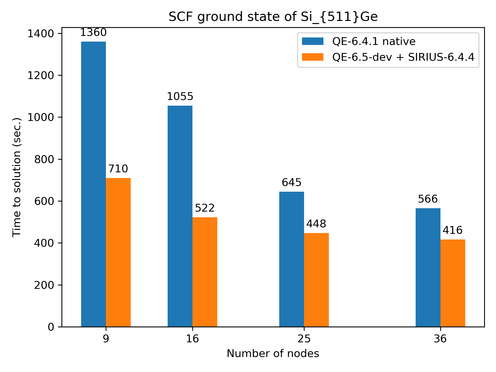
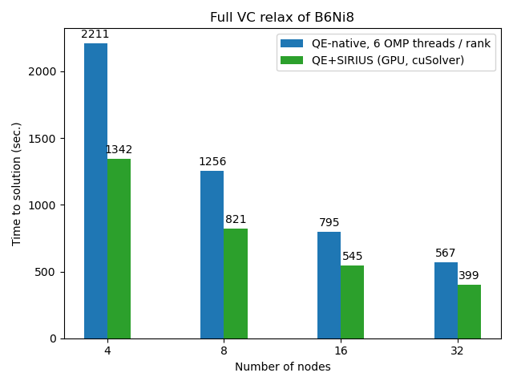

<p align="center">

</p>

[](https://github.com/electronic-structure/SIRIUS/releases)
[](https://matrix.to/#/#SIRIUS:staffchat.ethz.ch)
[](https://github.com/electronic-structure/SIRIUS/discussions)
[](https://electronic-structure.github.io/SIRIUS-doc)
[](https://raw.githubusercontent.com/electronic-structure/SIRIUS/master/LICENSE)
[](https://github.com/electronic-structure/SIRIUS/actions)
[](https://gitlab.com/cscs-ci/ci-testing/webhook-ci/mirrors/7415069138667150/4626796664769983/-/commits/master)
[](https://gitlab.com/cscs-ci/ci-testing/webhook-ci/mirrors/7415069138667150/4626796664769983/-/commits/develop)

## Table of contents
* [Introduction](#introduction)
* [Installation](#installation)
  * [Configuring SIRIUS](#configuring-sirius)
  * [Developing and debugging SIRIUS](#developing-and-debugging-sirius)
  * [Manual installation](#manual-installation)
  * [Installation on Piz Daint](#installation-on-piz-daint)
* [Accelerating DFT codes](#accelerating-dft-codes)
  * [Quantum ESPRESSO](#quantum-espresso)
  * [CP2K](#cp2k)
* [Contacts](#contacts)
* [Acknowledgements](#acknowledgements)

## Introduction
SIRIUS is a domain specific library for electronic structure calculations. It implements pseudopotential plane wave (PP-PW)
and full potential linearized augmented plane wave (FP-LAPW) methods and is designed for GPU acceleration of popular community
codes such as Exciting, Elk and Quantum ESPRESSO. SIRIUS is written in C++17 with MPI, OpenMP and CUDA/ROCm programming models.
SIRIUS is organised as a collection of classes that abstract away the different building blocks of DFT self-consistency cycle.

The following functionality is currently implemented in SIRIUS:
 * (PP-PW) Norm-conserving, ultrasoft and PAW pseudopotentials
 * (PP-PW) Spin-orbit coupling
 * (PP-PW) Stress tensor
 * (PP-PW, FP-LAPW) Atomic forces
 * (PP-PW, FP-LAPW) Collinear and non-collinear magnetism
 * (FP-LAPW) APW and LAPW basis sets with arbitrary number of local orbitals
 * (FP-LAPW) ZORA and IORA approximations for valence states; full relativistic Dirac equation for core states
 * Symmetrization of lattice-periodic functions and on-site matrices
 * Generation of irreducible k-meshes
 * Python frontend

## Installation
It is recommended to install SIRIUS through [Spack](https://spack.readthedocs.io/en/latest/getting_started.html). To set it up, use

```bash
git clone https://github.com/spack/spack.git
. spack/share/spack/setup-env.sh
spack install sirius
```

### Configuring SIRIUS

SIRIUS has many different configurations to enable specific hardware and library support. Some common setups include:

```bash
# Use default BLAS, LAPACK, MPI and FFTW3 implementations, without GPU support, using the latest GCC 9.x
$ spack install sirius %gcc@:9

# Explicitly use the latest 3.x release of MPICH for MPI, OpenBLAS for BLAS and LAPACK, FFTW for FFTW3, without GPU support
$ spack install sirius ^mpich@:3 ^fftw ^openblas

# Enable distributed linear algebra, and use Intel MKL for BLAS, ScaLAPACK and FFTW3, without GPU support
$ spack install sirius +scalapack ^intel-mkl

# Build with CUDA support for NVIDIA GPUs
$ spack install sirius +cuda cuda_arch=75

# Build with ROCm support for AMD GPUs
$ spack install sirius +rocm amdgpu_target=gfx906

# Build with MAGMA
$ spack install sirius +cuda +magma

# Build with ELPA
$ spack install sirius +scalapack +elpa
```

Language interop with Fortran and Python can be enabled with `+fortran` and `+python` respectively.

See `spack info sirius` for the full list of support variants.

### Developing and debugging SIRIUS

The recommended way to install the latest development version of SIRIUS is through `spack dev-build`.

As an example, the following builds SIRIUS with CUDA support in debug mode:

```bash
$ git clone --recursive -b develop https://github.com/electronic-structure/SIRIUS.git
$ cd SIRIUS
$ spack dev-build sirius@develop build_type=Debug +cuda
```

When more control over the build commands is necessary, use `spack build-env [spec] -- [command]`:

```bash
$ mkdir SIRIUS/build && cd SIRIUS/build
$ export SPEC="sirius@develop build_type=Debug +cuda"
$ spack install --only=dependencies $SPEC
$ spack build-env $SPEC -- cmake ..
$ spack build-env $SPEC -- make -j$(nproc)
```

### Manual installation

When installing SIRIUS without Spack, make sure to install the required dependencies first:

 * CMake ≥ 3.14
 * C++ compiler with C++17 support
 * MPI (OpenMPI or MPICH)
 * BLAS/LAPACK (OpenBLAS or Intel MKL)
 * [GSL](https://www.gnu.org/software/gsl/) - GNU scientific library
 * [LibXC](https://www.tddft.org/programs/libxc/) - library of exchange-correlation potentials
 * [HDF5](https://www.hdfgroup.org/solutions/hdf5/)
 * [spglib](https://spglib.github.io/spglib/) - library for finding and handling crystal symmetries
 * [SpFFT](https://github.com/eth-cscs/SpFFT) - domain-specific FFT library
 * [SPLA](https://github.com/eth-cscs/spla) - domain-specific distributed GEMM library

and optionally any of the additional libraries:
 * ScaLAPACK (Intel MKL or netlib scalapack)
 * [ELPA](https://elpa.mpcdf.mpg.de/software)
 * [DLA-Future](https://github.com/eth-cscs/DLA-Future)
 * [MAGMA](https://icl.cs.utk.edu/magma/)
 * CUDA/ROCm
 * [Eigen3](https://eigen.tuxfamily.org/index.php?title=Main_Page)**

\* Only required when `SIRIUS_BUILD_APPS=On` and your compiler does not support `std::filesystem` or `std::experimental::filesystem`.

\** Only required when `-DSIRIUS_BUILD_TESTING=On`

Clone the repository and build as follows:

```bash
git clone --recursive https://github.com/electronic-structure/SIRIUS.git
mkdir SIRIUS/build
cd SIRIUS/build
export CXX=mpicxx CC=mpicc FC=mpif90
export CMAKE_PREFIX_PATH="path/to/BLAS;path/to/GSL;path/to/LibXC;path/to/HDF5;..."
cmake -DCMAKE_INSTALL_PREFIX=$PWD/sirius
make -j install
```
where `CMAKE_PREFIX_PATH` is a list of installation paths of dependencies installed in non-standard locations.

#### Adding GPU support
To enable CUDA you need to pass the following options to CMake: `-DSIRIUS_USE_CUDA=On -DCMAKE_CUDA_ARCHITECTURES='60;70'`, where `CMAKE_CUDA_ARCHITECTURES` is
a list of NVIDIA architectures. Use `60`, `61`, `62` for Pascal; `70`, `72` for Volta; `75` for Turing; and `80` for Ampere.
If CUDA is installed in a non-standard directory, you have to pass additional parameter to cmake `-DCUDA_TOOLKIT_ROOT_DIR=/path/to/cuda`.

To enable MAGMA (GPU implementation of LAPACK) use `-DSIRIUS_USE_MAGMA=On`. Append MAGMA's installation directory to `CMAKE_PREFIX_PATH` if necessary.

#### Parallel eigensolvers
To compile with ScaLAPACK use `-DSIRIUS_USE_SCALAPACK=On`. To use ELPA, both `-DSIRIUS_USE_SCALAPACK=On` and `-DSIRIUS_USE_ELPA=On` are
required, as we need ScaLAPACK functionality to transform the generalized eigenvalue problem to standard form,
which can then be solved by ELPA. Append ScaLAPACK's and ELPA's install directory to `CMAKE_PREFIX_PATH` if necessary. To use DLA-Future use
`-DSIRIUS_USE_DLAF=ON`

#### Python module
Use `-DSIRIUS_CREATE_PYTHON_MODULE=On` to build the Python module. The SIRIUS Python module depends on `mpi4py` and
`pybind11`, which need to be installed on your system.

#### Additional options
To link against Intel MKL use `-DSIRIUS_USE_MKL=On`. For Cray libsci use `-DSIRIUS_USE_CRAY_LIBSCI=On`. Building tests requires `-DSIRIUS_BUILD_TESTING=On`.

By default example applications are built. This can be turned off via `-DSIRIUS_BUILD_APPS=Off`, which is recommended when just building Fortran bindings.

### Installation on Piz Daint
Please refer to the [SIRIUS wiki page](https://github.com/electronic-structure/SIRIUS/wiki/Build-on-Piz-Daint) and
[CSCS User portal](https://user.cscs.ch/computing/applications/sirius/) for detailed instructions.

## Accelerating DFT codes

### Quantum ESPRESSO
[Quantum ESPRESSO](https://www.quantum-espresso.org/) is a popular open source suite of computer codes for
electronic-structure calculations and materials modeling at the nanoscale. It is based on DFT, plane waves, and
pseudopotentials. We maintain the GPU-accelerated version of
[Quantum ESPRESSO with SIRIUS bindings](https://github.com/electronic-structure/q-e-sirius).
This version is frequently synchronised with the
`develop` branch of the official [QE repository](https://gitlab.com/QEF/q-e). A typical example of using SIRIUS
inside QE is listed below:
```Fortran
subroutine get_band_energies_from_sirius
  !
  use wvfct,    only : nbnd, et
  use klist,    only : nkstot, nks
  use lsda_mod, only : nspin
  use sirius
  !
  implicit none
  !
  integer, external :: global_kpoint_index
  !
  real(8), allocatable :: band_e(:,:)
  integer :: ik, nk, nb, nfv

  allocate(band_e(nbnd, nkstot))

  ! get band energies
  if (nspin.ne.2) then
    ! non-magnetic or non-collinear case
    do ik = 1, nkstot
      call sirius_get_band_energies(ks_handler, ik, 0, band_e(1, ik))
    end do
  else
    ! collinear magnetic case
    nk = nkstot / 2
    ! get band energies
    do ik = 1, nk
      call sirius_get_band_energies(ks_handler, ik, 0, band_e(1, ik))
      call sirius_get_band_energies(ks_handler, ik, 1, band_e(1, nk + ik))
    end do

  endif

  ! convert to Ry
  do ik = 1, nks
    et(:, ik) = 2.d0 * band_e(:, global_kpoint_index(nkstot, ik))
  enddo

  deallocate(band_e)

end subroutine get_band_energies_from_sirius
```
To compile Quantum ESPRESSO with SIRIUS it is easiest to use Spack. The following installs a CUDA enabled version:

```bash
spack install q-e-sirius ^sirius +shared +scalapack +cuda ~apps ^intel-mkl ^mpich
```

Now you can load `pw.x` and MPI related executables:

```bash
spack load q-e-sirius
```

Run `pw.x` using the same parameters and input files as you would with native QE. Note that you have to explicitly
enable SIRIUS through the command-line option `-sirius` in `pw.x`. For instance:

```bash
# run in default mode
pw.x -i pw.in
# run with SIRIUS enabled
pw.x -i pw.in -sirius
```

The SIRIUS library is using OpenMP for node-level parallelization. To run QE/SIRIUS efficiently, follow these simple rules:
 * always prefer k-point pool parallelization over band parallelization
 * use as few MPI ranks as possible for band parallelization
 * by default, use one rank per node and many OMP threads; if the calculated system is really small, try to saturate
   the GPU card by using more MPI ranks (e.g.: on a 12-core node, use 2-3-4 ranks with 6-4-3 OMP threads)

#### Benchmarks
In the following examples we compare the performance of native and SIRIUS-enabled versions of QE. CPU-only runs are executed
on dual-socket multi-core nodes containing two 18-core Intel Broadwell CPUs. GPU runs are executed on hybrid
nodes containing a 12-core Intel Haswell CPU and an NVIDIA Tesla P100 card:

|Hybrid partition (Cray XC50)                | Multicore partition (Cray XC40)                  |
|--------------------------------------------|--------------------------------------------------|
|Intel Xeon E5-2690 v3 @2.60GHz, 12 cores <br> NVIDIA Tesla P100 16GB | Two Intel Xeon E5-2695 v4 @2.10GHz (2 x 18 cores)|

Ground state calculation ([input](https://github.com/electronic-structure/benchmarks/tree/master/performance/Si511Ge))
of Si511Ge.

<p align="center">

</p>

Another example is the variable cell relaxation of B6Ni8 ([input](https://github.com/electronic-structure/benchmarks/tree/master/performance/B6Ni8)).
The Brillouin zone contains 204 irreducible k-points and only k-pool parallelization is used.

<p align="center">

</p>

### CP2K
[CP2K](https://www.cp2k.org/) uses the SIRIUS library to enable plane-wave functionality. The detailed description of the input parameters
can be found [here](https://manual.cp2k.org) under the `/CP2K_INPUT/FORCE_EVAL/PW_DFT` section.

## Contacts
If you have any questions, feel free to contact us:
  * Anton Kozhevnikov (anton.kozhevnikov@cscs.ch)
  * Mathieu Taillefumier (mathieu.taillefumier@cscs.ch)
  * Simon Pintarelli (simon.pintarelli@cscs.ch)

## Acknowledgements
The development of the SIRIUS library would not be possible without support of the following organizations:
| Logo | Name | URL |
|:----:|:----:|:---:|
|   | Swiss Federal Institute of Technology in Zürich | https://www.ethz.ch/      |
|   | Swiss National Supercomputing Centre            | https://www.cscs.ch/      |
|   | Platform for Advanced Scientific Computing      | https://www.pasc-ch.org/  |
| | NCCR MARVEL <br> Centre on Computational Design and Discovery of Novel Materials | https://nccr-marvel.ch/ |
|    | MAX (MAterials design at the eXascale) <br> European Centre of Excellence | http://www.max-centre.eu/   |
|  | Partnership for Advanced Computing in Europe | https://prace-ri.eu/  |
